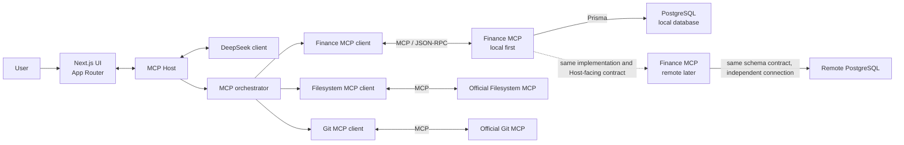

# Initial architecture and communication flow

## Purpose

This document records the initial architecture before the manual JSON-RPC/MCP implementation begins. The project is one TypeScript repository with explicit runtime boundaries; it is not an Nx, Turborepo or workspace-based monorepo.

## High-level view



The arrows indicate communication direction. Responses travel back over the same boundary as requests. The local and remote Finance MCP nodes are separate deployments of the same Finance MCP business and tool implementation; they do not synchronize databases.

## Component responsibilities

### Next.js UI

The `app/` directory contains the Next.js App Router application. It owns presentation and user interaction, including the future chat, read-only financial dashboard, MCP log view and confirmation controls. The UI never accesses PostgreSQL or Prisma directly.

### MCP Host

The Host is the application-side coordinator. Its planned responsibilities are separated under `host/`:

- `llm/`: DeepSeek request and response integration;
- `context/`: in-memory session context;
- `orchestration/`: one-turn intent and tool-call orchestration;
- `confirmation/`: explicit confirmation for every write operation;
- `mcp-clients/`: MCP server connections and MCP request/response logging.

The Host may interpret user intent with DeepSeek and explain authoritative results. It must not calculate financial values, access PostgreSQL for financial capabilities or import Finance MCP services, repositories or handlers.

### Finance MCP

`servers/finance-mcp/` owns the financial boundary:

- `tools/`: future MCP tool handlers;
- `services/`: future deterministic financial rules and calculations;
- `repositories/`: future persistence access through Prisma.

The Finance MCP is the source of truth for transactions, debts, receivables, inventory, balances, projections and purchase viability. It will expose the same Host-facing MCP contract locally first and remotely later.

### DeepSeek client

DeepSeek is an interpretation layer used by the Host. It can identify intent, request a tool call and explain a Finance MCP result. It cannot override or recalculate Finance MCP outputs.

### MCP orchestrator and clients

The Host orchestrator routes discovered tools to the matching MCP client. Finance, Filesystem and Git clients are independent connections. The custom Finance path is implemented manually with MCP/JSON-RPC; no MCP SDK hides the protocol exchange.

### PostgreSQL and Prisma

The Finance MCP owns database access. The current local setup is PostgreSQL 17 with Prisma 7 under `database/`. The local and future remote databases are independent. `database/schema/`, `database/migrations/`, `database/seed/` and the shared Prisma connection support the Finance MCP; they are not imported by the UI or Host.

### Official Filesystem and Git MCP servers

Filesystem MCP and Git MCP remain independent official servers. The Host can orchestrate them alongside Finance MCP without sharing their internals with the Finance MCP.

## Communication boundaries

The local financial flow is:

```text
UI
  -> Host
  -> Finance MCP client
  -> MCP / JSON-RPC request
  -> Finance MCP
  -> PostgreSQL through Prisma
  -> MCP / JSON-RPC response
  -> Host
  -> UI response
```

The Host-to-Finance boundary is always MCP/JSON-RPC, even when both components run on the same machine. A local filesystem import, service call or repository call is not a substitute for that protocol boundary. The Host does not connect to PostgreSQL to execute financial capabilities.

The future remote mode changes only transport, environment configuration, deployment concerns and database connection. Tool names, input/output contract and financial rules remain the same. Local and remote data remain independent; no synchronization is planned.

### Streamable HTTP transport

Finance MCP now also supports local MCP Streamable HTTP `2025-11-25` at `POST /mcp`. The HTTP server creates an in-memory `FinanceMcpLifecycle` for each `MCP-Session-Id`, while all sessions share the same composed registry, services, repositories and Prisma client. It accepts JSON-RPC over `application/json`; a client must accept both JSON and `text/event-stream`, but the server returns JSON only because it never initiates messages. `GET /mcp` therefore returns `405`.

The transport defaults to `127.0.0.1:3001`, validates explicit Origins against `MCP_ALLOWED_ORIGINS`, has a 1 MiB request limit, and does not provide authentication, persistence, SSE, WebSockets or old HTTP+SSE compatibility. STDIO remains available and uses the same lifecycle and tool composition.

## Data and authority rules

- PostgreSQL is the persistent runtime source of financial truth through Finance MCP.
- Prisma is used by Finance MCP persistence code, not by the UI or Host.
- Current balance is derived from initial account balances and real income/expense transactions; no mutable duplicate balance is maintained.
- Pending debts and receivables affect future projections, not current balance.
- DeepSeek explains Finance MCP results but is never authoritative for calculations.
- Write operations require explicit user confirmation in the Host before the Finance MCP call.

## MCP logs and tests

MCP logs belong to the Host boundary, with their implementation entry point under `host/mcp-clients/`. They remain separate from conversation context and are intended to be readable by the future UI. Entries will preserve the timestamp, session, server, direction, message type, method, request ID, raw JSON-RPC payload, status and duration where available. Secrets must never be logged.

Tests are kept under:

- `tests/unit/`: deterministic unit tests, including Host boundary checks and future protocol/financial rules;
- `tests/integration/`: Finance MCP, PostgreSQL and real MCP request/response integration tests.

Architecture and evidence artifacts remain under `docs/architecture/`, `docs/evidence/` and `docs/wireshark/`.

## Current repository structure

This is the structure established by the foundation tickets:

```text
app/                              Next.js App Router
host/
  llm/                            DeepSeek boundary
  context/                        Session context boundary
  orchestration/                 Host orchestration boundary
  confirmation/                  Write confirmation boundary
  mcp-clients/                    MCP clients and future logs
servers/
  finance-mcp/
    tools/                        Finance MCP tool handlers
    services/                     Financial rules and calculations
    repositories/                 Finance persistence access
shared/
  jsonrpc/                        Shared JSON-RPC contracts
  mcp/                            Shared MCP contracts
  types/                          Shared TypeScript types
database/
  schema/                         Prisma schema
  migrations/                     Prisma migrations
  seed/                           Deterministic seed
tests/
  unit/                           Unit tests
  integration/                    Integration tests
docs/
  architecture/                  Architecture documentation
  wireshark/                      Network capture artifacts
  evidence/                       Verification evidence
```

The current repository also contains the root Prisma scripts and connection helpers created by the foundation tickets. Empty boundaries are preserved with `.gitkeep` until their implementation tickets begin.

## Scope of this document

This document defines boundaries and communication direction only. It intentionally does not implement or specify detailed financial tools, JSON-RPC message schemas, MCP lifecycle handlers, remote deployment, Wireshark capture or the final README. Those belong to their respective future tickets and phases.
